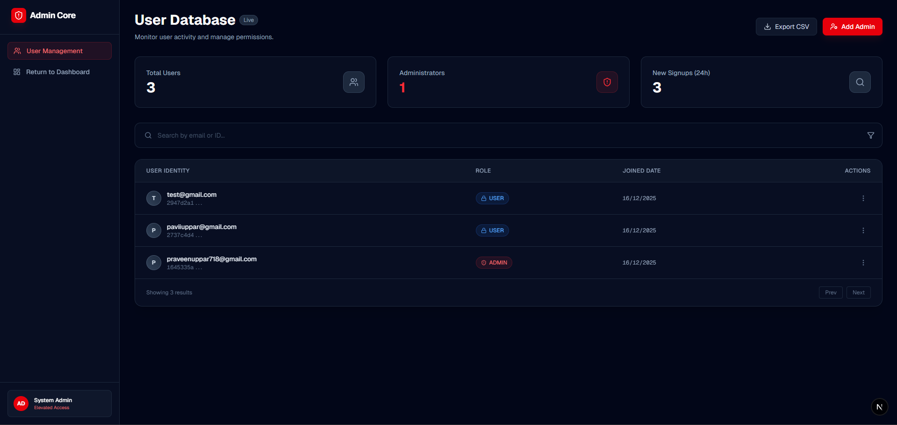
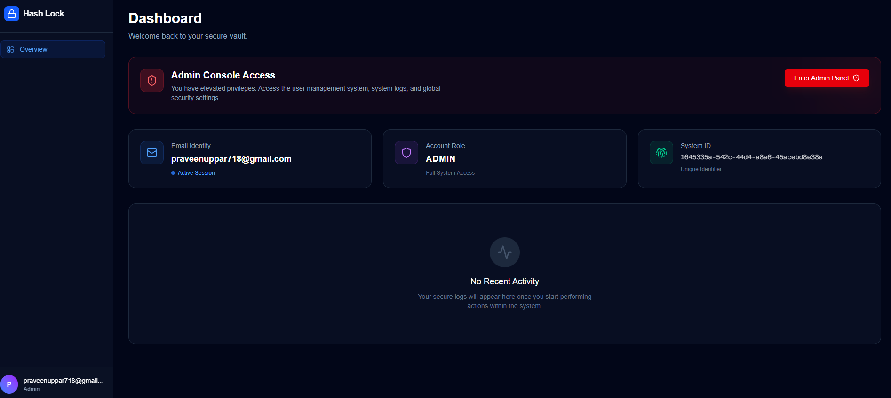
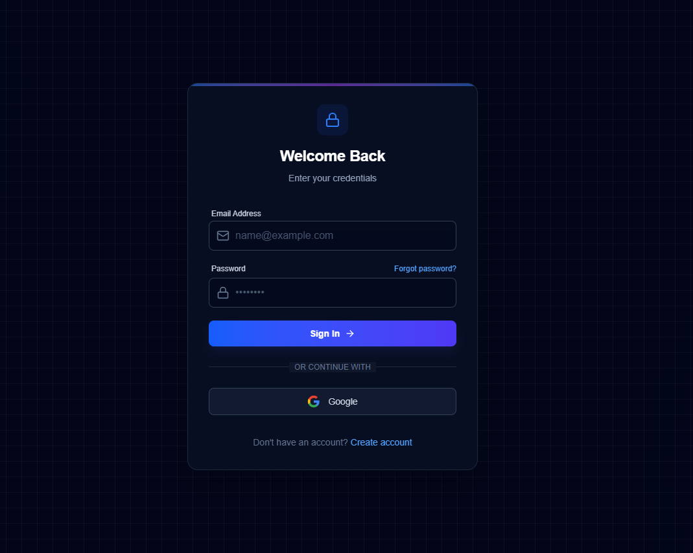

# Hash Lock

A robust, security-focused authentication system built entirely from scratch. This project demonstrates how to implement security patterns—including, OAuth 2.0, Role-Based Access Control (RBAC) and more. It emphasizes best practices, and secure session management.

**Project Link:** [https://hash-lock.pavicodes.in](https://hash-lock.pavicodes.in)

## Table of Contents

- [Tech Stack](#tech-stack)
- [Features](#features)
- [Database Schema](#database-schema)
- [Screenshots](#screenshots)
- [System Workflows](#system-workflows)
- [Concurrency & Inventory Safety](#concurrency--inventory-safety)
- [Environment Variables](#environment-variables)

## Tech Stack

- **Framework:** Next.js 15 (App Router, Server Actions)
- **Language:** TypeScript
- **Styling:** Tailwind CSS + Lucide Icons
- **Database:** PostgreSQL (hosted on Supabase)
- **ORM:** Prisma
- **Cryptography:** Argon2id
- **Validation:** Zod
- **Deployment:** Vercel

## Features

- Custom Credentials Auth: Secure email/password registration and login flows.
- O-Auth 2.0 Integration: "Sign in with Google" implementation with automatic account linking.
- Role-Based Access Control (RBAC): Middleware and server-side checks for User vs. Admin permissions.
- Stateful Session Management: Database-backed sessions using secure, HTTP-only, SameSite cookies.
- Password Recovery: Secure reset flow using time-limited, single-use tokens.
- Brute Force Protection: IP-based rate limiting on sensitive endpoints using Redis.
- Input Validation: Strict Zod schema validation for all API inputs.

## Database Schema

The normalized schema tightly links users, events, orders, tickets, and ticket variants with strict foreign keys to maintain referential integrity.

> _See `prisma/schema.prisma` for the full definition._

<p align="center">

</p>

## Screenshots

|              Admin Page              |               User Page                |            Login and SignUp            |
| :----------------------------------: | :------------------------------------: | :------------------------------------: |
|  |  |  |

## System Workflows

## Security Implementation

### Cryptography (Argon2id)

Instead of outdated algorithms like MD5 or fast algorithms like SHA-256 (which are vulnerable to GPU brute-forcing), this project uses Argon2id. It is memory-hard, making it significantly more expensive and slower for attackers to crack hashes offline.

### Rate Limiting (Upstash Redis)

To prevent brute-force attacks on the login endpoint:

Algorithm: Sliding Window.
Limit: 5 requests per 60 seconds per IP address.
Storage: Managed via Upstash Redis for low-latency edge checks.

Secure Headers
Middleware injects security headers into every response to prevent common attacks:

X-Content-Type-Options: nosniff
X-Frame-Options: DENY (Clickjacking protection)
Strict-Transport-Security (Force HTTPS)

## Environment Variables

```
# Database (Supabase)
DATABASE_URL="postgres://..."
DIRECT_URL="postgres://..."

# Google OAuth
GOOGLE_CLIENT_ID="your_google_client_id"
GOOGLE_CLIENT_SECRET="your_google_client_secret"

# App Configuration
NEXT_PUBLIC_APP_URL="http://localhost:3000"

# Rate Limiting (Upstash)
UPSTASH_REDIS_REST_URL="https://..."
UPSTASH_REDIS_REST_TOKEN="your_upstash_token"
```
